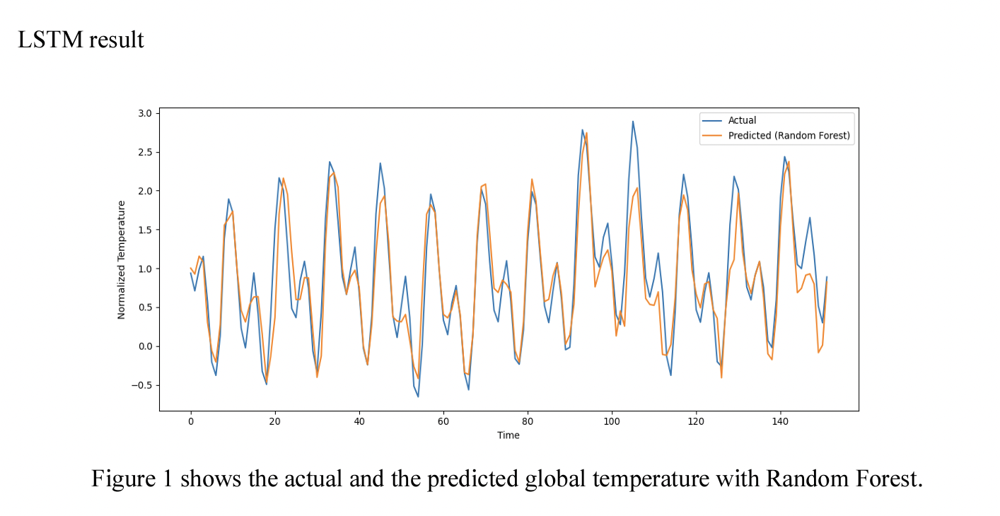
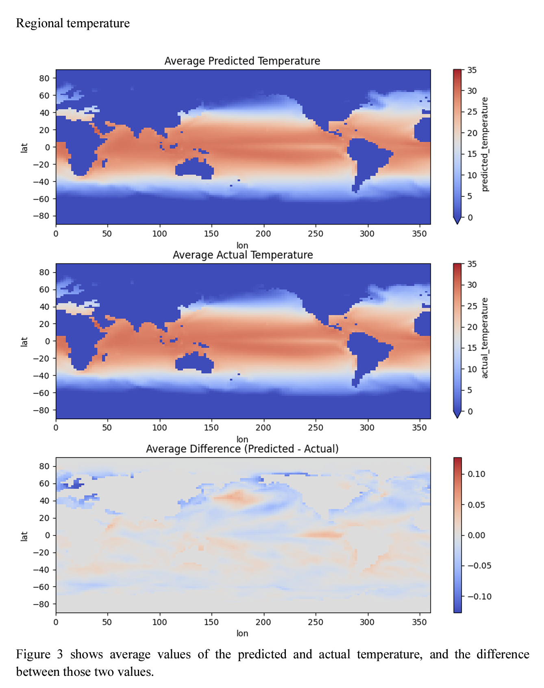

# Temperature Prediction by NASA Sea Surface Data

Data was provided by NASA-GISS

Supervised by Anastasia Romanou, Professor of Columbia University and NASA Goddard Institute.

### Abstract 
We are interested in the problem of predicting sea surface temperature with machine learning methods using only the relevant climate factors. We tried to resolve the cost inefficiency of the temperature predicting model uses over a million of data that is observed by about 6300 NASA weather stations, a typical model that prominent agencies like NASA uses. First of all, we minimized the required computing power by using only velocity and pressure variables. Moreover, we minimized the usage of data by using only 14GB of NASA-GISS data and supplemented the minimized data by comparing four different machine learning models to predict global sea surface temperature. In addition, beyond predicting the global sea surface temperature, we also wanted to delve into predicting each region’s temperature. Thus, we gridded the earth into 64,800 regions, based on latitudes and longitudes. However, the accuracy drastically decreased since the data was also divided into 64,800 parts. Therefore, we applied the Gaussian filter to our predicted outcomes, and it made a breakthrough in accuracy. This will have a huge impact on temperature prediction because it will astoundingly decrease the expense and the amount of data needed for predicting temperature.

### Figures

